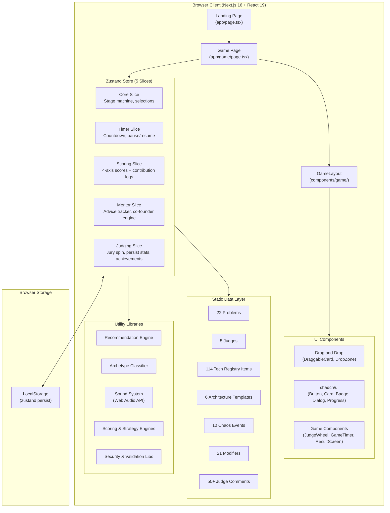
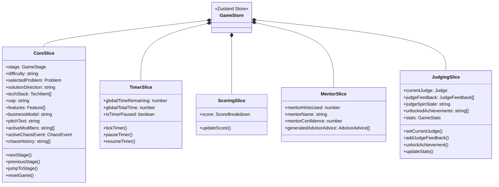
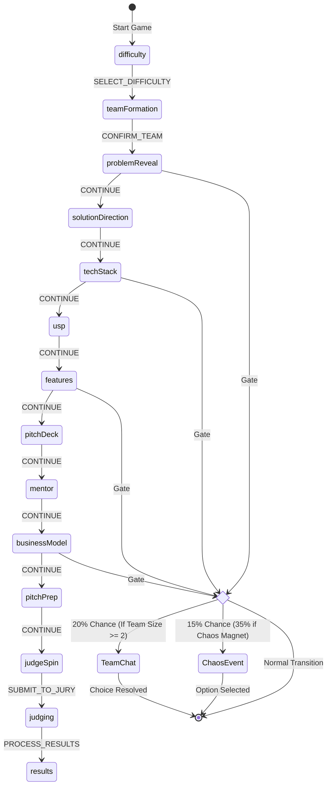
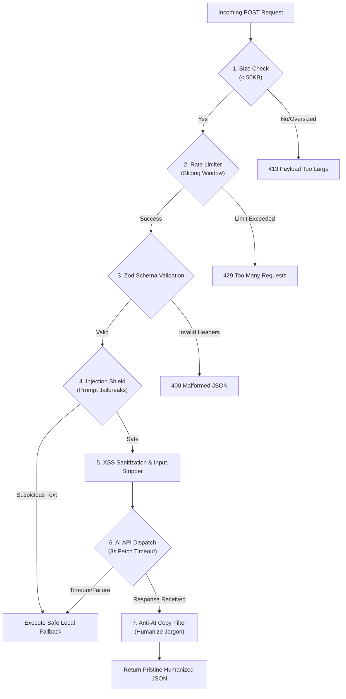

<div align="center">

# THE HACKATHON SIMULATOR

### Build. Ship. Survive.

*A gamified, turn-based hackathon experience, from team assembly to final judging, built entirely in the browser.*

[](https://nextjs.org/)
[](https://react.dev/)
[](https://typescriptlang.org/)
[](https://zustand-demo.pmnd.rs/)
[](https://www.framer.com/motion/)
[](https://opensource.org/licenses/MIT)

<br/>

> Ever wondered what it feels like to compete in a hackathon without leaving your desk?
>
> The Hackathon Simulator drops you into a timed, pressure-cooker scenario where every decision, from your team configuration to your elevator pitch, determines whether you walk away with the trophy or crash at compile time.

<br/>

[**Play Now**](#getting-started) · [**Documentation**](#architecture) · [**Report Bug**](https://github.com/udaysharmadev/The-Hackathon-Simulator/issues) · [**Request Feature**](https://github.com/udaysharmadev/The-Hackathon-Simulator/issues)

</div>

---

## Table of Contents

- [Overview](#overview)
- [Key Features](#key-features)
- [Architecture](#architecture)
  - [High-Level Architecture](#high-level-architecture)
  - [Zustand State Architecture](#zustand-state-architecture)
- [The 14-Stage Game Pipeline](#the-14-stage-game-pipeline)
- [Teammate & AI Co-Founder System (v2.0)](#teammate--ai-co-founder-system-v20)
  - [Teammate Personalities](#teammate-personalities)
  - [Interactive Advice & Gating](#interactive-advice--gating)
  - [Crew Voting Conflict Engine](#crew-voting-conflict-engine)
- [Pitch Deck Builder (v1.5)](#pitch-deck-builder-v15)
  - [Layout Narrative Analysis](#layout-narrative-analysis)
  - [Pitch Deck Archetypes](#pitch-deck-archetypes)
- [Scoring Engine & Point System](#scoring-engine--point-system)
  - [Scoring Categories](#scoring-categories)
  - [Judge Personality Profiles](#judge-personality-profiles)
  - [Synergy & Modifier Rules](#synergy--modifier-rules)
  - [Grade Thresholds](#grade-thresholds)
- [Security Audits & Hardened APIs](#security-audits--hardened-apis)
  - [Sliding Window Rate Limiter](#sliding-window-rate-limiter)
  - [Input Validation & XSS Sanitization](#input-validation--xss-sanitization)
  - [Prompt Injection Shield](#prompt-injection-shield)
  - [Timeout & Payload Protections](#timeout--payload-protections)
- [Anti-AI Language Filters & Humanization](#anti-ai-language-filters--humanization)
- [Chaos Engine](#chaos-engine)
- [Tech Stack](#tech-stack)
- [Project Structure](#project-structure)
- [Getting Started](#getting-started)
- [Data Models](#data-models)
- [Contributing](#contributing)
- [Development Roadmap](#development-roadmap)
- [License](#license)

---

## Overview

The Hackathon Simulator is a single-player, turn-based strategy simulation built with Next.js 16, React 19, and Zustand 5. It faithfully recreates the entire lifecycle of a hackathon: selecting a difficulty level, assembling a balanced team of developers and designers, receiving a randomized problem statement, building an architecture stack with intelligent recommendation matrices, prioritizing features, organizing a presentation deck outline, consulting co-founder mentors, preparing a pitch, and defending your project before specialist judges.

The core gameplay is a focused turn-based challenge with a global countdown timer. Every choice you make silently adjusts internal scores across four main categories, with teammates and AI co-founders actively auditing your decisions. At the end, a randomly selected judge evaluates your run and delivers personalized, context-aware commentary, or a brutal roast, based on every selection you made.

---

## Key Features

- **The 14-Stage Pipeline**: From choosing difficulty and forming your crew to the compiler animation and results dashboard.
- **Teammates & Co-Founders (v2.0)**: Onboard 4 unique teammates who offer active advice and spark realistic voting conflicts on strategies.
- **Pitch Deck Builder (v1.5)**: Assemble a slide deck from 31 available components, evaluated on logical flow, storytelling, and clarity.
- **Hardened Security Architecture**: Absolute protection against exploitation, implementing rate limiters, payload controls, and prompt injection shields.
- **Anti-AI Copier Filter**: Dynamic text cleaning that converts generic AI jargon and removes emoji bloat, ensuring roasts and PRDs read naturally.
- **Vector Recommendation Engine**: Adaptive tech recommendations matching 42 unique combinations of solution directions and USPs.
- **Procedural Roast Fallbacks**: Secure procedural text generators that guarantee instant, witty commentary if external APIs time out.
- **Persistent Achievement Tracker**: 13 unique milestones stored in LocalStorage alongside run histories and telemetry charts.

---

## Architecture

### High-Level Architecture



### Zustand State Architecture

The central game state is structured into five logical slices. This structure supports high modularity and keeps state management clean:



---

## The 14-Stage Game Pipeline

The simulation implements a linear stage machine. Players progress turn by turn, with chaos events and co-founder conversations triggering dynamically at transition gates:



---

## Teammate & AI Co-Founder System (v2.0)

Compete alongside a simulated product team. Rather than building solo, you assemble a squad that reacts directly to your scoping and architectural choices.

### Teammate Personalities

You can choose from four core specialist roles at the start of the game, each with distinct preferences:

- **The Builder (Backend / AI)**: Focuses on technical feasibility and scaling databases. Prefers standard templates like Node.js or FastAPI, and hates over-engineering.
- **The Designer (UI / UX)**: Evaluates user friction, styling, and visual onboarding flows. Prioritizes stunning screens and hates headless architectures.
- **The Dreamer (AI / Innovations)**: Pushes for cutting-edge frameworks, vector registries, and highly innovative USPs.
- **The Founder (Strategy / Business)**: Keeps an eye on market size, LTV, pricing models, and pitch narrative clarity.

### Interactive Advice & Gating

Using a **Help Token**, you can request strategic feedback from a teammate once per stage:
- **Observation**: What the teammate notices about your current project state.
- **Concern**: What technical or commercial risk your choice introduces.
- **Recommendation**: A concrete actionable change proposed by the teammate.
- **Expected Impact & Tradeoffs**: The numeric score changes that will apply if you follow the advice.

Teammate suggestions are gated using a **Stage Relevancy Checker**. A teammate will refuse to offer advice if the current stage is outside their expertise. For example, a frontend designer will stay silent during database migration setup, keeping advice focused and contextually sound.

### Crew Voting Conflict Engine

When choosing a **Unique Selling Proposition (USP)** or **Business Model**, you can initiate a **Crew Vote** to secure alignment:

- **Enthusiastic Consensus**: If an option is outstanding, which means average scores exceed 75% or a key metric is above 85%, the entire crew votes **YES** in unison.
- **Dynamic Split Voting (Conflict)**: For standard options, teammates vote individually based on role preferences:
  - Backend developers vote **NO** on decentralized exchange structures, complaining about race conditions and database locks.
  - Designers vote **NO** on developer API models, pointing out that a headless product gives the judges nothing to look at.
  - Strategists vote **NO** on transaction models with thin margins, pointing out low LTV ratios.
  - If a majority approves, the strategy is applied and grants a **+5 Bonus Points** team alignment boost.

---

## Pitch Deck Builder (v1.5)

Players must organize a cohesive presentation deck to convince the jury. The deck builder lets you drag and drop slides from a pool of **31 available components** into an ordered outline of up to 10 slots.

### Layout Narrative Analysis

An evaluation engine checks your slide order and provides analytical critiques:
- **Problem before Solution**: Placing the customer pain slide before the solution slide increases clarity, boosting scores.
- **Tech before Problem Penalty**: Leading with backend architecture diagrams before stating the customer problem causes a major deduction.
- **Wedge Sequence**: Placing TAM/SAM/SOM, competitor moats, and business models in consecutive order yields a large business score bonus.
- **Context Switches**: Rapidly alternating between deep tech and high-level marketing slides causes visual fatigue, reducing persuasion scores.

### Pitch Deck Archetypes

Based on your slide composition, the deck is classified into one of eight distinct archetypes:

- **Engineer Deck**: Heavily focused on tech stacks, codebases, and systems architecture, with little market validation.
- **Founder Deck**: Driven by storytelling, customer personas, user journeys, and clean pain-to-cure transitions.
- **Investor Deck**: Dominated by financial TAM calculations, competitor matrices, and go-to-market strategies.
- **Designer Deck**: Visually mapped with customer personas, storyboard journeys, and prototype screens.
- **Balanced Deck**: A clean, high-grade mixture of storytelling, technical execution, and commercial viability.
- **Chaos Deck**: A fragmented slide order with duplicate slides or rapid context switches.

---

## Scoring Engine & Point System

The game implements a multi-axis scoring matrix. Every decision silently updates hidden variables, which are compiled during judging.

```
Weighted Score = (Innovation x W_inno) + (Execution x W_exec) + (Design x W_des) + (Pitch x W_pit)
Final Score = Clamped (Weighted Score + Synergy Bonuses + Modifier Adjustments, 0, 100)
```

### Scoring Categories

| Category | Maximum | Focus Area |
|---|---|---|
| **Innovation** | 100 | Novelty of concept, tech integration depth, and USP impact. |
| **Execution** | 100 | Feature completion, database scaling, and template slot accuracy. |
| **Design** | 100 | UI/UX screens, user onboarding flow, and accessibility ratings. |
| **Pitch** | 100 | Business model fit, presentation order, and slide deck clarity. |
| **Bonus** | Unlimited | Synergy rewards, crew vote alignment, and chaos resolutions. |

### Judge Personality Profiles

Each judge weights your performance differently, adapting the final grade to their professional background:

- **Dr. Priya Kapoor (CTO - Technical)**: Focuses heavily on Execution (45%) and Tech Depth. Penalizes over-engineered bloat.
- **Alex Nakamura (CEO - Creative)**: Values Innovation (35%) and bold storytelling.
- **Marcus Rivera (Design Head - Encouraging)**: Prioritizes Design (45%) and visual polish.
- **Victoria Chen (VC Partner - Tough)**: Checks commercial viability, scaling, and Pitch (35%).
- **Lord Bugsworth (Dean of Chaos - Unpredictable)**: Applies an even 25% weight across all axes, then adds a random score offset.

### Synergy & Modifier Rules

- **Tech Synergies**: Combining compatible tools (like Next.js + Vercel for +8 points, or ESP32 + MQTT for +10 points) triggers bonus multipliers.
- **Strategic Modifiers**: Rules that alter calculations. For example:
  - `LIMITED_BUDGET`: Rejects high-overhead infrastructure like AWS and PostgreSQL, penalizing execution.
  - `FAST_SHIP`: Reduces scores if you attempt to build more than two Must-Have features.
  - `ACCESSIBILITY_MANDATE`: Applies a baseline design penalty that must be offset with high-contrast UI choices.

### Grade Thresholds

| Grade | Score Range | Status | Verdict |
|---|---|---|---|
| **S** | 94 to 100 | Approved | Venture-Scale Unicorn Potential |
| **A** | 84 to 93 | Approved | High-Growth Accelerator Target |
| **B** | 72 to 83 | Approved | Promising Seed Bootstrapper |
| **C** | 60 to 71 | Approved | Standard Lifestyle Business |
| **D** | 48 to 59 | Failed | Compile Failed (Duct-taped Prototype) |
| **F** | Below 48 | Failed | Compile Failed (Digital Smoke) |

---

## Security Audits & Hardened APIs

All AI endpoints (including PRD generation, custom problem creation, and final project roasts) are protected by a hardened server architecture, preventing data leaks or server load issues.



### Sliding Window Rate Limiter

Implemented in `lib/rateLimit.ts`, the rate limiter tracks client IPs using a sliding window buffer:
- **Configuration**: Maximum of 10 requests per minute per IP.
- **Memory Leak Protection**: Runs active cache pruning every 10 minutes, clearing stale timestamps and freeing up memory.
- **Upstream Proxy Support**: Extracts real client IPs securely, parsing `x-forwarded-for`, `x-real-ip`, and Cloudflare headers to prevent IP spoofing.

### Input Validation & XSS Sanitization

- **Zod Schemas**: Every API payload is verified against strict schemas. Unexpected parameters are discarded, and string lengths are clamped to prevent buffer overloads.
- **XSS Sanitizer**: The system strips HTML tags and escapes characters (like `<` to `&lt;`, and `>` to `&gt;`), rendering user inputs safe for display in React components.

### Prompt Injection Shield

An active text scanner scans all user inputs for jailbreak attempts:
- Identifies common attack signatures, such as "ignore previous instructions", "system override", or "developer mode".
- **Silent Defensive Action**: If a prompt injection attempt is detected, the API blocks the request to external LLMs and redirects to the local procedural fallback generator, ensuring a smooth user experience.

### Timeout & Payload Protections

- **Oversized Payload Rejections**: Inspects the `Content-Length` header, rejecting requests larger than 50KB immediately to protect server bandwidth.
- **Fetch Timeout Aborts**: Dispatches network requests with a 3-second timeout. If the AI model lags, an `AbortController` terminates the connection, switching immediately to local procedural fallbacks.

---

## Anti-AI Language Filters & Humanization

To maintain a professional, natural, and engaging tone, all generated text passes through a humanization filter in `cleanAndHumanizeRoast`:

1. **Jargon Stripping**: Searches for and removes typical AI copywriter words, such as *delve*, *realm*, *landscape*, *testament*, *seamless*, *robust*, *groundbreaking*, *ever-evolving*, *foster*, and *pivotal*.
2. **Quote Normalization**: Converts curly quotes (`“”` and `‘’`) to clean straight quotes (`"` and `'`) to prevent visual syntax issues.
3. **Typography Cleanup**: Automatically removes markdown bold tags (`**`) and cleans up spacing or punctuation anomalies.
4. **Absolute Emoji and Em-dash Ban**: Strips all em-dashes and emojis, keeping text readable and professional.

---

## Chaos Engine

The Chaos Engine introduces unpredictable events that interrupt gameplay between stage transitions. Each event presents a binary choice with meaningful tradeoffs:

- **10 Core Incidents**: Covering technical failures (spilled energy drinks, API outages), team conflicts, sponsor unlocks, and last-minute jury mandate pivots.
- **Weighted Selection**: Events are selected using a weighted random algorithm that excludes previously triggered incidents.
- **Modifier Activations**: Certain choices apply permanent rules to your run, changing the judging parameters.

---

## Tech Stack

| Tool | Version | Purpose |
|---|---|---|
| **Next.js** | 16.2.6 | Asynchronous React Meta-Framework with App Router |
| **React** | 19.2.4 | Dynamic Component Rendering Engine |
| **Zustand** | 5.0.14 | Persistent State Store with Slice Architecture |
| **Framer Motion** | 12.40.0 | Fluid Transitions, Springs, and SVG Animations |
| **@dnd-kit** | 6.3.1 | Drag-and-Drop system for Tech Stack & Features |
| **Tailwind CSS** | 4.x | Utility-first Design Tokens and Layout Styling |
| **Lucide React** | 1.17.0 | Clean, Scalable Monochromatic Icons |
| **Web Audio API** | Native | Real-time Synthesized Audio Chords (Zero Media Assets) |

---

## Project Structure

```
The-Hackathon-Simulator/
│
├── app/                              # Next.js App Router Pages
│   ├── layout.tsx                    # Global Fonts, Metadata, and SEO
│   ├── page.tsx                      # Landing Lobby Page
│   ├── globals.css                   # Tailwind Design Tokens and Styles
│   │
│   ├── game/
│   │   └── page.tsx                  # Main Orchestrator and 14 Stage Components
│   │
│   ├── results/
│   │   └── page.tsx                  # Static Results Page with Radar Charts
│   │
│   └── api/                          # Hardened Backend APIs
│       ├── generate-prd/             # Product Requirements API
│       ├── generate-problem/         # Seeded Problem Generator
│       ├── generate-roast/           # Live Project Roast API
│       └── generate-usps/            # Dynamic Startup USP Generator
│
├── components/
│   ├── drag-drop/                    # Accessible @dnd-kit Assemblies
│   ├── game/                         # Timer, SVG Roulette, Result Screens
│   └── ui/                           # Primitive shadcn components
│
├── data/                             # Curated Game Data
│   ├── architectureTemplates.ts      # 6 Solution-specific Slots
│   ├── techRegistry.ts               # 114 Curated Technologies
│   ├── judges.ts                     # 5 Personality scoring weights
│   ├── chaosEvents.ts                # 10 Weighted Random Incidents
│   ├── modifiers.ts                  # 21 Rule modifiers
│   └── judgeComments.ts              # 50+ Contextual Feedback Templates
│
└── lib/                              # Logic Utilities
    ├── rateLimit.ts                  # IP sliding-window tracker
    ├── security.ts                   # XSS, timeout, and injection shields
    ├── pitchDeckEvaluator.ts         # Slide layout analysis
    ├── prdGenerator.ts               # Procedural PRD Compiler
    ├── archetypes.ts                 # Project Archetype Classifier
    ├── sound.ts                      # Synthesized Audio Generator
    └── scoring.ts                    # Scoring Engines
```

---

## Getting Started

### Prerequisites

- **Node.js** version 18.0 or higher
- **npm** version 9.0 or higher

### Installation

1. Clone the repository:
   ```bash
   git clone https://github.com/udaysharmadev/The-Hackathon-Simulator.git
   cd The-Hackathon-Simulator
   ```

2. Install dependencies:
   ```bash
   npm install
   ```

3. Start the local development server:
   ```bash
   npm run dev
   ```

Open **http://localhost:3000** in your browser to launch the lobby.

---

## Data Models

### Tech Registry Item

```typescript
export interface TechRegistryItem {
  id: string;
  name: string;
  category: string;
  difficultyScore: number; // 1 to 5
  compatibleSolutions: string[];
  innovationWeight: number;
  executionWeight: number;
  designWeight: number;
  pitchWeight: number;
  synergy?: string[]; // IDs of synergistic items
  conflicts?: string[]; // IDs of incompatible items
  tags: string[];
}
```

### Generated Business Model

```typescript
export interface GeneratedBusinessModel {
  id: string;
  name: string;
  desc: string;
  customer: string;
  valueProp: string;
  monetization: string;
  riskLevel: 'Low' | 'Medium' | 'High';
  pricingStructure: string;
  customerSegment: string;
  revenueStream: string;
  growthStrategy: string;
  potentialStrengths: string;
  potentialRisks: string;
}
```

---

## Contributing

We welcome contributions to expand the simulator. To get started:

1. **Fork** the repository.
2. Create a feature branch: `git checkout -b feature/amazing-feature`.
3. Commit your changes with clear descriptions: `git commit -m "feat: add robust IoT database templates"`.
4. Push your branch: `git push origin feature/amazing-feature`.
5. Open a Pull Request.

Please ensure all additions compile cleanly and include appropriate TypeScript interfaces in `types/game.ts`.

---

## Development Roadmap

### Completed Sprints

- **Sprint 1**: Redesign of the Paper Terminal aesthetic and typography.
- **Sprint 2**: State machine slices, persistent stats, and LocalStorage.
- **Sprint 3**: Strategic gameplay systems, tech templates, and drag-drop queues.
- **Update v1.1**: Chaos incidents engine and weighted random selections.
- **Update v1.2**: Structured tech recommendation filters and judge personalities.
- **Update v1.5**: Drag-and-drop Pitch Deck Builder and narrative analyzer.
- **Update v1.8**: Contextual AI Roast API and local backup generators.
- **Update v2.0**: Teammate advice cards, relevancy gates, and crew voting conflicts.
- **Security Audit**: API rate limiters, payload validation, and prompt injection shields.

### Future Sprints

- [ ] **Multiplayer Sandbox**: Compete against active developers in real-time rooms.
- [ ] **Global Leaderboard**: Daily challenges and score rank maps.
- [ ] **Custom Judge Builder**: Design profiles, weighting priorities, and comment templates.
- [ ] **Voice Judging**: Text-to-speech audio for final Q&A rounds.

---

## License

This project is licensed under the **MIT License**. See the [LICENSE](LICENSE) file for details.

---

<div align="center">

### Built with care by the Hackathon Simulator Team

**[Back to Top](#the-hackathon-simulator)**

</div>
