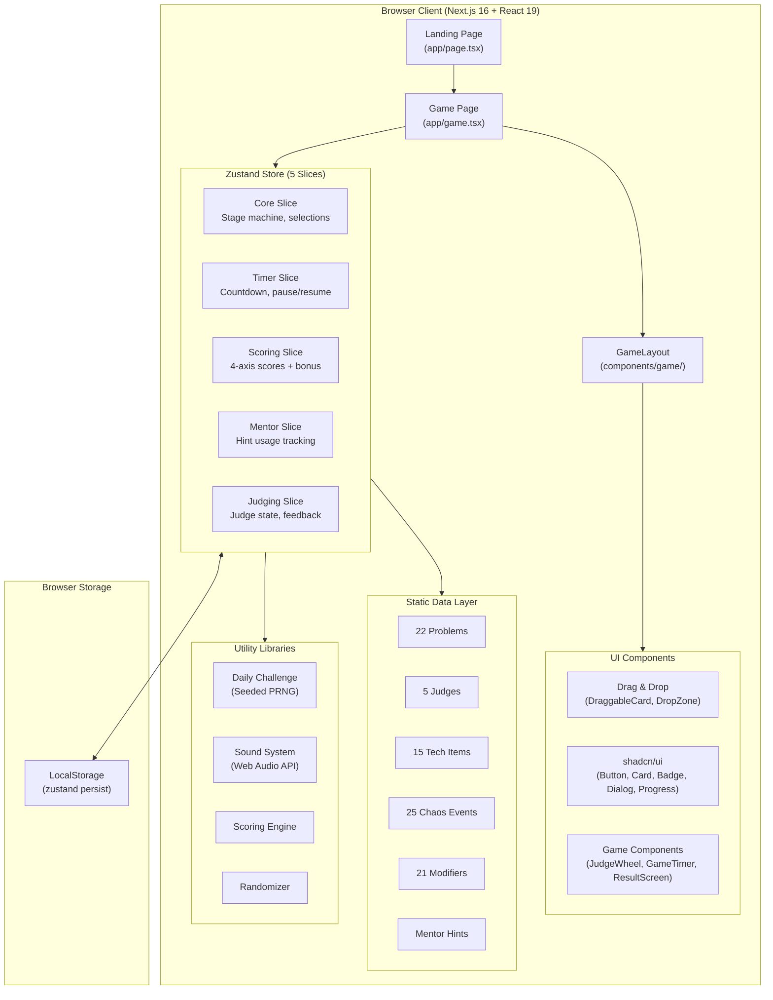
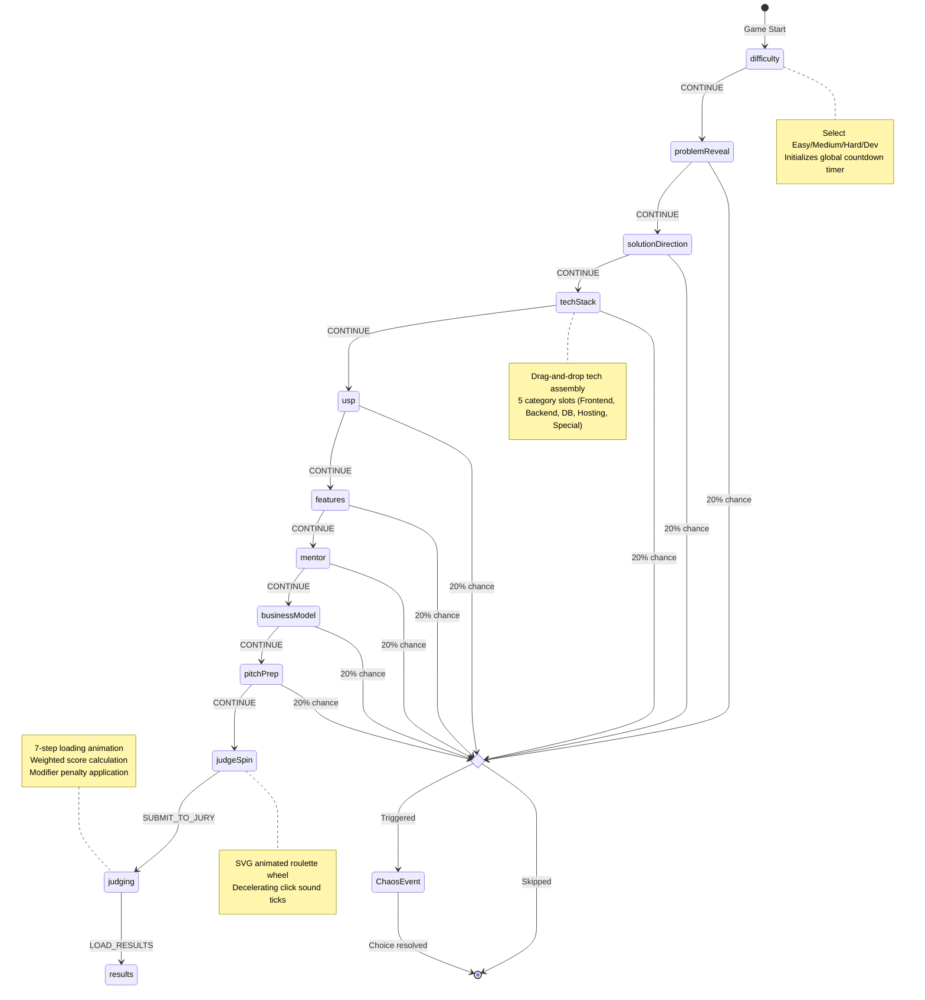
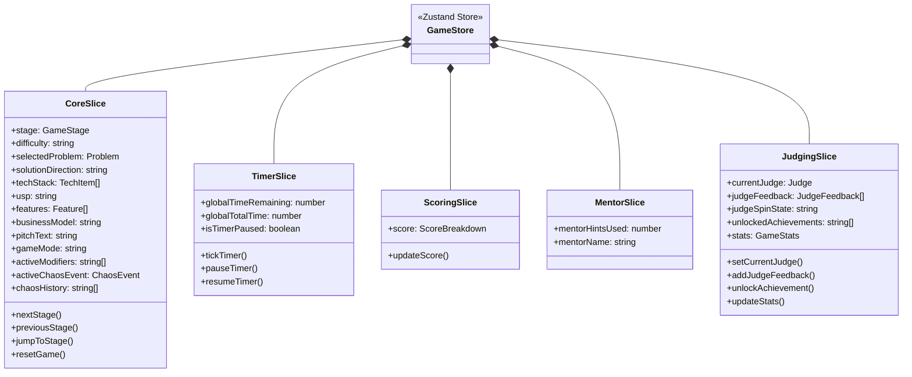
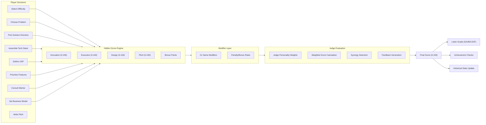
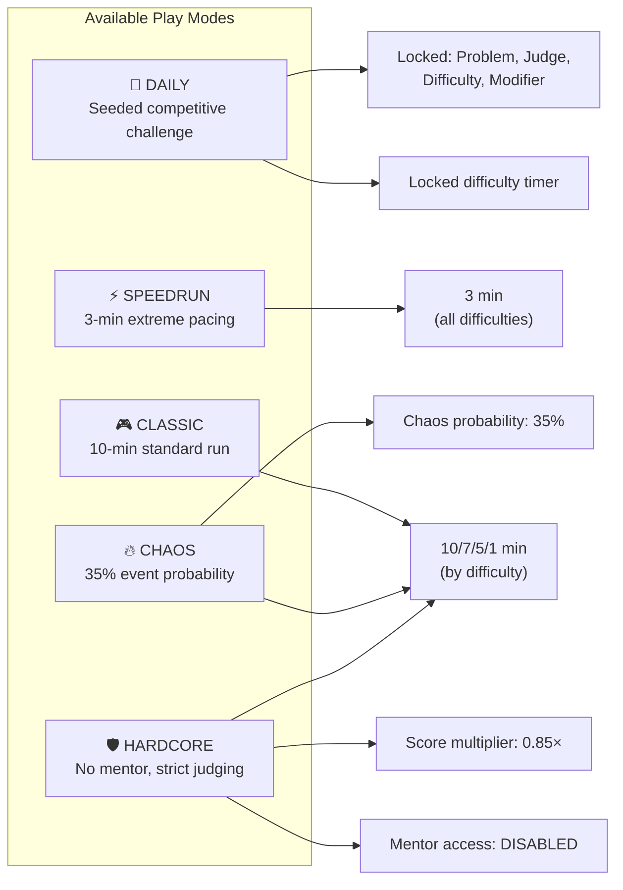

<div align="center">

# ⚡ THE HACKATHON SIMULATOR

### **Build. Ship. Survive.**

*A gamified, turn-based hackathon experience — from problem reveal to final judging — built entirely in the browser.*

[](https://nextjs.org/)
[](https://react.dev/)
[](https://typescriptlang.org/)
[](https://zustand-demo.pmnd.rs/)
[](https://www.framer.com/motion/)
[](https://opensource.org/licenses/MIT)

<br/>

> **Ever wondered what it feels like to compete in a hackathon without leaving your desk?**
>
> The Hackathon Simulator drops you into a timed, pressure-cooker scenario where every decision — from your tech stack to your elevator pitch — determines whether you walk away with the trophy or crash at compile time.

<br/>

[**🎮 Play Now**](#-getting-started) · [**📖 Documentation**](#-architecture) · [**🐛 Report Bug**](https://github.com/udaysharmadev/The-Hackathon-Simulator/issues) · [**✨ Request Feature**](https://github.com/udaysharmadev/The-Hackathon-Simulator/issues)

</div>

---

## 📑 Table of Contents

- [Overview](#-overview)
- [Key Features](#-key-features)
- [Screenshots](#-screenshots)
- [Architecture](#-architecture)
  - [High-Level Architecture](#high-level-architecture)
  - [Game Stage Pipeline](#game-stage-pipeline)
  - [State Management (Zustand Store)](#state-management-zustand-store)
  - [Data Flow](#data-flow)
- [Game Mechanics Deep Dive](#-game-mechanics-deep-dive)
  - [12-Stage Game Pipeline](#12-stage-game-pipeline)
  - [Scoring Engine](#scoring-engine)
  - [Chaos Engine](#chaos-engine)
  - [Daily Challenge System](#daily-challenge-system)
  - [Modifier System](#modifier-system)
  - [Judge Evaluation Engine](#judge-evaluation-engine)
  - [Achievement System](#achievement-system)
  - [Sound System](#sound-system)
- [Play Modes](#-play-modes)
- [Tech Stack](#-tech-stack)
- [Project Structure](#-project-structure)
- [Getting Started](#-getting-started)
- [Data Models](#-data-models)
- [Contributing](#-contributing)
- [Development Roadmap](#-development-roadmap)
- [License](#-license)

---

## 🔭 Overview

The Hackathon Simulator is a **single-player, turn-based strategy simulation** built with Next.js 16, React 19, and Zustand 5. It faithfully recreates the entire lifecycle of a hackathon — from selecting a difficulty level and receiving a randomized problem statement, all the way through tech stack assembly, feature prioritization, mentor consultation, pitch preparation, and final jury evaluation.

### What Makes It Unique

| Aspect | Description |
|--------|-------------|
| 🎲 **Procedural Challenges** | 22 curated problems across 7 categories, randomized each run |
| ⏱️ **Real-Time Pressure** | Difficulty-scaled countdown timers that tick during every stage |
| 🌪️ **Chaos Events** | 25 weighted random events that interrupt gameplay with meaningful tradeoffs |
| 📊 **Hidden Scoring** | 4-axis scoring matrix (Innovation, Execution, Design, Pitch) with hidden synergy bonuses |
| 🎡 **Judge Roulette** | SVG-animated spinning wheel that randomly selects from 5 personality-driven judges |
| 📅 **Daily Challenges** | Seeded PRNG-based competitive daily runs with locked parameters |
| 🎵 **Synthesized Audio** | Web Audio API-driven sound effects — no external assets required |
| 🏆 **13 Achievements** | Persistent unlockable milestones tracked across sessions |
| 💾 **Persistent Stats** | LocalStorage-backed historical performance tracking |

---

## 🌟 Key Features

### 🎮 Five Distinct Play Modes
- **Classic** — The standard 10-minute full hackathon experience
- **Daily Challenge** — Seeded competitive runs with locked problem, judge, and modifier
- **Speedrun** — 3-minute global timer for extreme execution pacing
- **Chaos** — Elevated 35% chaos event probability with unstable compiler conditions
- **Hardcore** — No mentor access, stricter judging, increased penalty distributions

### 🧩 Strategic Decision Making
- **6 Solution Directions** — Web App, Mobile App, AI Solution, IoT Hardware, Service Platform, Marketplace
- **15 Technologies** with **drag-and-drop** stack assembly and **4 tech synergies**
- **7 USP Options** with hidden score tradeoffs
- **10 Backlog Features** with 3-bucket prioritization (Must-Have / Nice-to-Have / Overkill)
- **7 Business Models** with contextual alignment bonuses

### 🤖 Dynamic Systems
- **Mentor Advisor** — Context-aware feedback analyzing your stack, scoping, and alignment
- **25 Chaos Events** — Weighted, categorized (Technical / Team / Lucky / Judge) with binary choice resolution
- **21 Game Modifiers** — Rule-changing conditions that alter scoring during judging
- **5 Judge Personalities** — Each with unique scoring weights and feedback tones

---

## 📸 Screenshots

> *The Hackathon Simulator uses a "Paper Terminal" design system — a minimal, monospaced, editorial aesthetic inspired by physical typewriter outputs and vintage terminal interfaces.*

### Landing Page
The landing page features a daily challenge card with a live countdown timer, seeded metadata display (problem, judge, modifier), and four play mode selection cards.

### Game Stages
Each stage is wrapped in a consistent `GameplayStageCard` component displaying:
- Stage number and name
- Active game mode badge
- Difficulty indicator
- Global countdown timer
- Active modifier indicators
- Progress dot navigation

### Results Dashboard
The final results screen includes:
- Score index out of 50 (scaled from 0–100)
- Animated letter grade stamp (S/A/B/C/D/F)
- Jury verdict (APPROVED / COMPILE FAILED)
- Run summary manifest
- Strength/weakness analysis
- Judge reasoning memo
- Achievement grid with unlock states
- Shareable ASCII art card with clipboard copy

---

## 🏗️ Architecture

### High-Level Architecture



### Game Stage Pipeline

The simulator operates as a **linear state machine** with 12 sequential stages. The player progresses forward (and can navigate backward) through each stage, with chaos events potentially interrupting between transitions.



### State Management (Zustand Store)

The game state is managed by a single Zustand store composed of **5 logical slices**, enhanced with `devtools` and `persist` middleware.



#### Persistence Strategy

The store uses Zustand's `persist` middleware with a **custom `partialize` function** that selectively saves only essential cross-session data:

| Persisted | Not Persisted |
|-----------|---------------|
| `unlockedAchievements` | `stage`, `phase` |
| `stats` (historical runs) | `score` (current run) |
| `soundEnabled` | `techStack`, `features` |
| | `activeChaosEvent` |
| | `globalTimeRemaining` |

Storage key: `hackathon-simulator-sprint2-persist`

### Data Flow



---

## 🎯 Game Mechanics Deep Dive

### 12-Stage Game Pipeline

| # | Stage | Key | Description | Player Action |
|---|-------|-----|-------------|--------------|
| 01 | **Difficulty** | `difficulty` | Set compilation budget and time | Select Easy (10m) / Medium (7m) / Hard (5m) / Dev (60s) |
| 02 | **Problem Reveal** | `problemReveal` | Randomized startup challenge | Review or shuffle for a new problem statement |
| 03 | **Solution Direction** | `solutionDirection` | Choose architecture layout | Select from 6 project types (Web, Mobile, AI, IoT, Platform, Marketplace) |
| 04 | **Tech Stack** | `techStack` | Assemble technology pipeline | Drag-and-drop 15 techs into 5 category slots |
| 05 | **USP** | `usp` | Define competitive advantage | Choose from 7 USP profiles with hidden tradeoffs |
| 06 | **Features** | `features` | Backlog prioritization | Categorize 10 features into Must/Nice/Overkill buckets |
| 07 | **Mentor** | `mentor` | Consult advisor | Run one-time mentor audit (context-aware feedback) |
| 08 | **Business Model** | `businessModel` | Set revenue strategy | Select from 7 monetization models |
| 09 | **Pitch Prep** | `pitchPrep` | Compile elevator pitch | Review manifest, edit pitch text, review talking points |
| 10 | **Judge Spin** | `judgeSpin` | Jury selector roulette | Spin SVG wheel to randomly select a judge |
| 11 | **Judging** | `judging` | Evaluation pipeline | Watch 7-step compiler animation, receive score |
| 12 | **Results** | `results` | Final dashboard | View scores, achievements, strengths/weaknesses, share card |

---

### Scoring Engine

The simulator uses a **hidden 4-axis scoring system** where every player decision silently adjusts internal score values. Players never see their raw scores until the final evaluation.

#### Score Categories

| Category | Range | What It Measures |
|----------|-------|------------------|
| **Innovation** | 0–100 | Novelty of solution, tech choices, USP alignment |
| **Execution** | 0–100 | Implementation quality, scoping discipline, stack feasibility |
| **Design** | 0–100 | UI/UX quality, polish, visual considerations |
| **Pitch** | 0–100 | Presentation quality, business model fit, strategic alignment |
| **Bonus** | 0+ | Extra points from synergies, modifiers, and special conditions |

#### Tech Stack Synergies

Combining specific technologies triggers **hidden bonus multipliers**:

| Synergy Combo | Bonus Effect |
|--------------|-------------|
| **Next.js + Vercel** | Execution +10, Design +10, Bonus +5 |
| **OpenAI/Gemini + Next.js** | Innovation +15, Pitch +10, Bonus +10 |
| **ESP32 + Arduino** | Innovation +15, Execution +10, Bonus +10 |
| **Supabase + PostgreSQL** | Execution +12, Bonus +5 |

#### Score Modifiers by Decision

Each major decision applies hidden score adjustments:

```
Solution Direction → Base score offsets (e.g., AI Solution: Innovation +25, Pitch +20)
USP Selection     → Score weight redistribution (e.g., Fastest: Execution 75, Innovation 50)
Feature Scoping   → Over-scoping penalty: Execution -18, Design -5 (if >3 must-haves)
Business Model    → Contextual fit bonuses (e.g., Gov Partnership + Sustainability = Pitch +20)
Mentor Consult    → Pitch -3, Bonus +5 (advisor reliance cost)
```

---

### Chaos Engine

The Chaos Engine introduces **unpredictable events** that interrupt gameplay between stage transitions. Each event presents a **binary choice** with meaningful tradeoffs.

#### Event Categories

| Category | Count | Weight Range | Nature |
|----------|-------|-------------|--------|
| 🔴 **Technical** | 8 events | 5–10 | Server crashes, dependency conflicts, deployment issues |
| 🟡 **Team** | 7 events | 6–10 | Teammate issues, burnout, asset loss, scope arguments |
| 🟢 **Lucky** | 6 events | 8–10 | Sponsor APIs, mentor impressions, coffee deliveries |
| 🔵 **Judge** | 4 events | 7–8 | Last-minute jury mandate changes |

#### Trigger Probability

| Game Mode | Chaos Probability |
|-----------|------------------|
| Classic | 20% per stage transition |
| Chaos Mode | 35% per stage transition |
| Speedrun | 20% per stage transition |
| Hardcore | 20% per stage transition |
| Daily | 20% per stage transition |

#### Event Selection Algorithm

Events are selected using a **weighted random algorithm**:

```typescript
// Pseudocode for weighted selection
function getRandomChaosEvent(excludeIds: string[]): ChaosEvent {
  const available = CHAOS_EVENTS.filter(e => !excludeIds.includes(e.id));
  const totalWeight = available.reduce((acc, e) => acc + e.weight, 0);
  let roll = Math.random() * totalWeight;
  
  for (const event of available) {
    roll -= event.weight;
    if (roll <= 0) return event;
  }
}
```

#### Example Event: "API Rate Limit Hit"

```
┌─────────────────────────────────────────┐
│ ⚠ CRITICAL HACKATHON INCIDENT DETECTED  │
├─────────────────────────────────────────┤
│ EVENT: API Rate Limit Hit               │
│ CATEGORY: [TECHNICAL_FIRE]              │
│                                         │
│ The third-party API model you planned   │
│ to use just rate limited your app's     │
│ sandbox keys.                           │
│                                         │
│ CHOICE A: Simplify Features             │
│   → Execution +15, Innovation -10       │
│   → Time remaining +30s                 │
│                                         │
│ CHOICE B: Push Through                  │
│   → Innovation +15, Execution -10       │
│   → Time remaining -45s                 │
└─────────────────────────────────────────┘
```

---

### Daily Challenge System

The Daily Challenge provides a **competitive, seeded run** that is identical for all players on a given day. It uses a **deterministic Linear Congruential Generator (LCG)** seeded by the current date.

#### Seed Generation

```typescript
function getDailySeed(): number {
  const d = new Date();
  return d.getFullYear() * 10000 + (d.getMonth() + 1) * 100 + d.getDate();
  // e.g., May 30, 2026 → 20260530
}
```

#### LCG Implementation

```typescript
function createSeededRandom(seed: number) {
  let s = seed;
  return function () {
    s = (s * 1664525 + 1013904223) % 4294967296;
    return s / 4294967296;
  };
}
```

#### Locked Parameters

Each daily challenge deterministically locks:

| Parameter | Source Pool |
|-----------|-----------|
| **Problem** | 22 problems |
| **Difficulty** | Easy / Medium / Hard |
| **Judge** | 5 judges |
| **Modifier** | 21 modifiers |

The landing page displays a live preview card with a countdown timer showing time until the next challenge resets at midnight (local time).

---

### Modifier System

Modifiers are **rule-changing conditions** that alter scoring during the final jury evaluation. They apply penalties or bonuses based on the player's choices throughout the run.

#### Complete Modifier Reference (21 Modifiers)

| ID | Name | Effect |
|----|------|--------|
| `NO_AI_TOOLS` | No AI Tools | -25 Innovation if AI tech/USP used |
| `BOOTSTRAP_ONLY` | Bootstrap Only | -20 Execution if AWS/PostgreSQL used |
| `MOBILE_ONLY` | Mobile Only | -25 Execution if non-mobile direction |
| `WEB_ONLY` | Web Only | -25 Execution if non-web direction |
| `AI_ONLY` | AI Only | -25 Execution if non-AI direction |
| `LIMITED_BUDGET` | Limited Budget | -15 Execution base penalty |
| `GREEN_FIRST` | Green First | +15 Bonus if Sustainable USP or Gov model |
| `USER_SENSITIVE` | User Sensitive | +15 Design if ≥80, else -25 Design |
| `TECH_WIZARD` | Tech Wizard | Double synergy bonus points |
| `SOLO_DEV` | Solo Dev | Lucky break time bonuses disabled |
| `FAST_SHIP` | Fast Ship | -20 Execution if >2 must-have features |
| `NO_MENTOR` | No Mentor | -30 Pitch if mentor was consulted |
| `OPEN_SOURCE` | Open Source | -15 Innovation penalty |
| `MONETIZE_NOW` | Monetize Now | -20 Pitch if Freemium/Ads model |
| `CHAOS_MAGNET` | Chaos Magnet | Elevated chaos event probability |
| `SECURITY_FIRST` | Security First | -20 Execution if no Supabase/PostgreSQL |
| `MINIMALIST` | Minimalist | -15 Design if features ≠ 2 |
| `CLOUD_NATIVE` | Cloud Native | -15 Innovation if no Vercel/AWS |
| `ACCESSIBILITY_MANDATE` | Accessibility Mandate | -15 Design baseline penalty |
| `HARDCORE_JUDGE` | Hardcore Judge | 0.85x final score multiplier |
| `PIVOT_FRIENDLY` | Pivot Friendly | Pivot events yield enhanced bonuses |

---

### Judge Evaluation Engine

The judging system uses a **weighted scoring formula** based on the selected judge's personality-driven category weights.

#### Judge Profiles

| Judge | Personality | Innovation | Execution | Design | Pitch |
|-------|------------|-----------|-----------|--------|-------|
| ⚡ **Dr. Priya Kapoor** (CTO) | Technical | 20% | **45%** | 10% | 25% |
| 🚀 **Alex Nakamura** (CEO) | Creative | **35%** | 15% | 20% | 30% |
| 🎨 **Marcus Rivera** (Design Head) | Encouraging | 15% | 15% | **45%** | 25% |
| 🦈 **Victoria Chen** (VC Partner) | Tough | 20% | 30% | 15% | **35%** |
| 👾 **Lord Bugsworth** (Dean of Chaos) | Tough | 25% | 25% | 25% | 25% |

> **Lord Bugsworth** applies an additional random offset of ±20 points, making his evaluations unpredictable.

#### Score Calculation Formula

```
weighted_score = (Innovation × W_innovation) + (Execution × W_execution) 
               + (Design × W_design) + (Pitch × W_pitch)

final_score = weighted_score + bonus_points
            × (0.85 if hardcore mode)
            ± (random offset if Lord Bugsworth)

CLAMPED to [0, 100]
```

#### Grade Thresholds

| Grade | Score Range | Verdict |
|-------|-----------|---------|
| **S** | ≥ 94 | Project Approved |
| **A** | 84 – 93 | Project Approved |
| **B** | 72 – 83 | Project Approved |
| **C** | 60 – 71 | Project Approved |
| **D** | 48 – 59 | Compile Failed |
| **F** | < 48 | Compile Failed |

> Scores ≥ 70 are considered "Project Approved" for jury verdict display.

#### Feedback Generation

Each judge generates personality-specific feedback based on score thresholds:

```
Score ≥ 90: Exceptional praise (personality-tinted)
Score ≥ 70: Solid acknowledgment with minor critique
Score < 70: Critical feedback highlighting failures
```

---

### Achievement System

The simulator tracks **13 persistent achievements** that unlock based on specific gameplay conditions. Achievements persist across sessions via LocalStorage.

| Achievement | Unlock Condition |
|------------|-----------------|
| 🎯 **Scope Master** | Must-Have features count = 2 or 3 |
| 🧠 **Startup Brain** | Business model matches problem category |
| 🔧 **Technical Wizard** | Activate ≥ 2 stack synergies |
| ⭐ **Judge Favorite** | Earn score ≥ 90/100 |
| ⚡ **Speed Builder** | Choose "Fastest" USP |
| 🤖 **AI Pioneer** | Combine AI models with AI USP |
| 🌪️ **Chaos Survivor** | Face ≥ 2 negative events & survive |
| 💰 **Frugal Founder** | Freemium model + Cheapest USP |
| 📐 **Lean & Mean** | 2 features, ≤ 3 stack items |
| 🔮 **Omniscient** | Used the mentor advisor |
| 🛡️ **Crisis Manager** | Resolve ≥ 2 negative events & score ≥ 80 |
| 🍀 **Lucky Builder** | Face ≥ 1 lucky break & score ≥ 85 |
| 🔄 **Pivot Master** | Execute a last-minute project pivot |

---

### Sound System

The simulator features a **fully synthesized audio system** built on the Web Audio API. No external audio files are used — all sounds are generated programmatically in real-time.

| Sound Effect | Trigger | Technique |
|-------------|---------|-----------|
| `playMutedClick()` | Button clicks | Sine wave 800→120Hz in 40ms |
| `playSubtleHover()` | Element hover | 1400Hz sine, 15ms duration |
| `playSnapSound()` | Drag-drop success | Double tick at 400Hz + 600Hz |
| `playWarningTick()` | Timer warning (<60s) | 380Hz sine, 120ms decay |
| `playWheelSpinClick()` | Judge wheel rotation | 1000Hz triangle wave, 10ms |
| `playScoreChord()` | Score reveal | C major 7th chord (C4-E4-G4-B4) |
| `playUnlockArpeggio()` | Achievement unlock | Ascending arpeggio (C4→C5) |

Sound can be toggled on/off globally via the Dev Debug Panel or Zustand store.

---

## 🎮 Play Modes



### Mode Comparison Table

| Feature | Classic | Daily | Speedrun | Chaos | Hardcore |
|---------|---------|-------|----------|-------|----------|
| Timer | Difficulty-based | Locked | 3 min (all) | Difficulty-based | Difficulty-based |
| Chaos Rate | 20% | 20% | 20% | **35%** | 20% |
| Mentor Access | ✅ | ✅ | ✅ | ✅ | ❌ |
| Judge Scoring | Standard | Standard | Standard | Standard | **0.85× multiplier** |
| Problem | Random | **Locked (seeded)** | Random | Random | Random |
| Judge | Random | **Locked (seeded)** | Random | Random | Random |
| Modifier | None | **Locked (seeded)** | None | None | `HARDCORE_JUDGE` |
| Competitive | No | **Yes (same for everyone)** | No | No | No |

---

## 🛠️ Tech Stack

| Layer | Technology | Version | Purpose |
|-------|-----------|---------|---------|
| **Framework** | [Next.js](https://nextjs.org/) | 16.2.6 | React meta-framework with App Router |
| **UI Library** | [React](https://react.dev/) | 19.2.4 | Component rendering engine |
| **Language** | [TypeScript](https://typescriptlang.org/) | 5.x | Static type safety |
| **State** | [Zustand](https://zustand-demo.pmnd.rs/) | 5.0.14 | Lightweight state management with middleware |
| **Animation** | [Framer Motion](https://www.framer.com/motion/) | 12.40.0 | Layout animations, page transitions, spring physics |
| **Drag & Drop** | [@dnd-kit](https://dndkit.com/) | 6.3.1 | Accessible drag-and-drop for tech stack & features |
| **Styling** | [Tailwind CSS](https://tailwindcss.com/) | 4.x | Utility-first CSS framework |
| **Icons** | [Lucide React](https://lucide.dev/) | 1.17.0 | Consistent icon system |
| **Components** | [shadcn/ui](https://ui.shadcn.com/) | 4.8.3 | Accessible, composable UI primitives |
| **Fonts** | [Inter](https://rsms.me/inter/) + [JetBrains Mono](https://www.jetbrains.com/lp/mono/) | — | Sans-serif body + monospace terminal text |
| **Audio** | Web Audio API | Native | Synthesized sound effects (no audio files) |
| **Storage** | LocalStorage | Native | Persistent achievements & historical stats |

---

## 📁 Project Structure

```
The-Hackathon-Simulator/
├── app/                          # Next.js App Router pages
│   ├── layout.tsx                # Root layout (fonts, metadata, SEO)
│   ├── page.tsx                  # Landing page (modes, daily challenge, stats)
│   ├── globals.css               # Global styles + Paper Terminal design tokens
│   └── game/
│       └── page.tsx              # Main game orchestrator (2,457 lines)
│                                 #   ├── GameplayStageCard (reusable wrapper)
│                                 #   ├── DifficultyStage
│                                 #   ├── ProblemRevealStage
│                                 #   ├── SolutionDirectionStage
│                                 #   ├── TechStackStage (DnD)
│                                 #   ├── UspStage
│                                 #   ├── FeaturesStage (DnD)
│                                 #   ├── MentorStage
│                                 #   ├── BusinessModelStage
│                                 #   ├── PitchPrepStage
│                                 #   ├── JudgeSpinStage (SVG wheel)
│                                 #   ├── JudgingStage (evaluation engine)
│                                 #   ├── ResultsStage (dashboard)
│                                 #   ├── DevDebugPanel
│                                 #   └── ChaosEventOverlay (modal)
│
├── components/
│   ├── drag-drop/                # Drag-and-drop system
│   │   ├── DraggableCard.tsx     # Draggable wrapper component
│   │   ├── DropZone.tsx          # Drop target container
│   │   ├── TechStackDnD.tsx      # Tech stack DnD implementation
│   │   └── FeaturePriorityDnD.tsx # Feature prioritization DnD
│   ├── game/                     # Game-specific components
│   │   ├── GameLayout.tsx        # Persistent game chrome/layout
│   │   ├── GameTimer.tsx         # Countdown timer display
│   │   ├── JudgeWheel.tsx        # SVG spinning wheel
│   │   ├── ProblemReveal.tsx     # Problem statement card
│   │   ├── DecisionCard.tsx      # Generic decision option card
│   │   └── ResultScreen.tsx      # Results dashboard component
│   └── ui/                       # shadcn/ui primitives
│       ├── button.tsx
│       ├── card.tsx
│       ├── badge.tsx
│       ├── dialog.tsx
│       ├── progress.tsx
│       └── separator.tsx
│
├── data/                         # Static game data (curated content)
│   ├── problems.ts               # 22 hackathon problems (7 categories)
│   ├── judges.ts                 # 5 judge profiles with scoring weights
│   ├── techItems.ts              # 15 tech items + hidden score weights
│   ├── chaosEvents.ts            # 25 chaos events (4 categories)
│   ├── modifiers.ts              # 21 game modifiers
│   └── mentorHints.ts            # Context-aware mentor feedback data
│
├── lib/                          # Utility libraries
│   ├── dailyChallenge.ts         # Seeded PRNG + daily challenge generator
│   ├── sound.ts                  # Web Audio API synthesized sound system
│   ├── scoring.ts                # Score calculation utilities
│   ├── randomizer.ts             # Weighted random selection helpers
│   └── utils.ts                  # General utility functions (cn)
│
├── store/
│   └── gameStore.ts              # Zustand store (5 slices, persist, devtools)
│
├── types/
│   └── game.ts                   # Core TypeScript type definitions
│
├── package.json                  # Dependencies & scripts
├── tsconfig.json                 # TypeScript configuration
├── next.config.ts                # Next.js configuration
└── tailwind.config.ts            # Tailwind CSS configuration
```

---

## 🚀 Getting Started

### Prerequisites

- **Node.js** ≥ 18.x
- **npm** ≥ 9.x (or **pnpm** / **yarn**)

### Installation

```bash
# Clone the repository
git clone https://github.com/udaysharmadev/The-Hackathon-Simulator.git

# Navigate to the project
cd The-Hackathon-Simulator

# Install dependencies
npm install

# Start the development server
npm run dev
```

The app will be available at **`http://localhost:3000`**

### Build for Production

```bash
# Create optimized production build
npm run build

# Start the production server
npm start
```

### Available Scripts

| Script | Command | Description |
|--------|---------|-------------|
| `dev` | `npm run dev` | Start Next.js development server with HMR |
| `build` | `npm run build` | Create optimized production build |
| `start` | `npm start` | Serve production build |
| `lint` | `npm run lint` | Run ESLint code analysis |

---

## 📊 Data Models

### Problem Statement (`data/problems.ts`)

22 curated problem statements spanning 7 categories:

| Category | Count | Example Problem |
|----------|-------|----------------|
| 🎓 EdTech | 4 | LearnFlow AI, QuizWiz Games, EduScribe, CodeQuest RPG |
| 🏥 HealthTech | 4 | MindFull Anonymous, MedTrack Companion, ... |
| 💰 FinTech | 3 | Micro-lending platforms, expense trackers, ... |
| 🌱 Sustainability | 4 | Carbon offset tools, smart waste management, ... |
| 🤖 AI | 3 | Cognitive search pipelines, autonomous agents, ... |
| 🏫 Smart Campus | 2 | Indoor navigation, resource optimization, ... |
| 🤝 Social Impact | 2 | Community engagement platforms, ... |

Each problem includes:
- `id`, `title`, `description`
- `category`, `difficulty` (beginner / intermediate / advanced)
- `constraints[]` — hard requirements the solution must satisfy
- `bonusObjectives[]` — stretch goals for extra points
- `judgingHint` — strategic pitch guidance

### Technology Pool (`data/techItems.ts`)

15 technologies organized into 5 category slots:

| Slot | Technologies | Difficulty Range |
|------|-------------|-----------------|
| **Frontend** | Next.js, React | ⭐⭐ |
| **Backend** | Node.js, FastAPI | ⭐⭐ |
| **Database** | Firebase, Supabase, PostgreSQL, MongoDB | ⭐ – ⭐⭐⭐ |
| **Hosting** | AWS, Vercel, Docker | ⭐ – ⭐⭐⭐⭐ |
| **Special** | Gemini API, OpenAI API, ESP32, Arduino | ⭐⭐⭐ – ⭐⭐⭐⭐ |

Each tech item has:
- Hidden scoring weights (`innovation`, `feasibility`, `design`, `pitchPotential`)
- Synergy connections to other technologies

### Chaos Events (`data/chaosEvents.ts`)

25 events with weighted random selection, organized by category:

- **8 Technical** — API crashes, dependency hell, merge conflicts, SSL expiry
- **7 Team** — Teammate disappearance, burnout, coffee spills, scope arguments
- **6 Lucky** — Sponsor API access, mentor impressions, coffee deliveries
- **4 Judge** — Last-minute jury mandate changes (sustainability, open source, accessibility)

---

## 🤝 Contributing

Contributions are welcome! Here's how to get started:

### Development Workflow

1. **Fork** the repository
2. **Create** a feature branch (`git checkout -b feature/amazing-feature`)
3. **Commit** your changes (`git commit -m 'feat: add amazing feature'`)
4. **Push** to the branch (`git push origin feature/amazing-feature`)
5. **Open** a Pull Request

### Contribution Guidelines

- Follow the existing code style and architecture patterns
- All new features should include proper TypeScript types in `types/game.ts`
- New game data should follow the existing interfaces in the `data/` directory
- State changes should go through the Zustand store slices
- Sound effects should use the Web Audio API pattern in `lib/sound.ts`
- Test your changes with all 5 play modes

### Areas for Contribution

| Area | Description |
|------|-------------|
| 📝 **New Problems** | Add hackathon problem statements to `data/problems.ts` |
| 🌪️ **Chaos Events** | Create new events in `data/chaosEvents.ts` |
| 🎖️ **Achievements** | Design new achievement conditions |
| 🎨 **UI Polish** | Enhance animations, transitions, and responsive design |
| 🧪 **Testing** | Add unit tests for scoring engine and state management |
| 📱 **Mobile UX** | Improve touch interactions and responsive layouts |
| 🌐 **i18n** | Add multi-language support |
| ♿ **Accessibility** | Improve keyboard navigation and screen reader support |

---

## 🗺️ Development Roadmap

### Completed Sprints

| Sprint | Focus | Status |
|--------|-------|--------|
| Sprint 1 | Paper Terminal redesign | ✅ Complete |
| Sprint 2 | Game engine architecture (Zustand slices, persistence) | ✅ Complete |
| Sprint 3A | Playable core simulator (12 stages) | ✅ Complete |
| Sprint 3B | Strategic gameplay (scoring, synergies, mentor) | ✅ Complete |
| Sprint 3C | Full playable v1 (judging, results, achievements) | ✅ Complete |
| Update v1.1 | Chaos events system (25 events) | ✅ Complete |
| Update v1.2 | Play modes, daily challenges, modifiers | ✅ Complete |

### Future Ideas

- [ ] **Multiplayer Mode** — Compete against friends in real-time
- [ ] **Leaderboard** — Global daily challenge rankings
- [ ] **Custom Problem Creator** — User-generated problem statements
- [ ] **Team Builder** — Simulated AI teammates with skill profiles
- [ ] **Extended Judging** — Multi-round jury panels
- [ ] **Tutorial Mode** — Guided walkthrough for first-time players
- [ ] **Mobile App** — React Native or PWA version
- [ ] **API Backend** — Server-side daily challenge verification

---

## 📄 License

This project is licensed under the **MIT License** — see the [LICENSE](LICENSE) file for details.

---

<div align="center">

### Built with ⚡ by the Hackathon Simulator Team

**[⬆ Back to Top](#-the-hackathon-simulator)**

</div>
